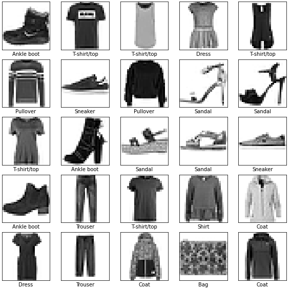
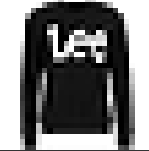
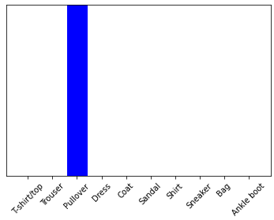
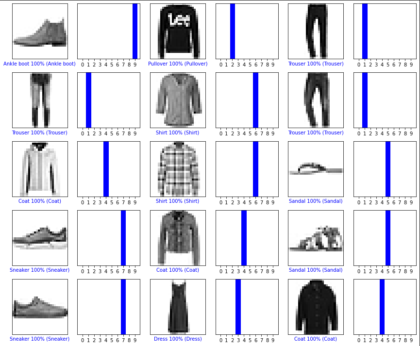

# Image Fashion Classification

* Build a basic neural network model with TensorFlow and Keras to train the program to classify images of clothing (ex. snickers and shirts) from the MNIST dataset.



* Test the prediction is correct on Jupyter Notebook

## Requirements

* Python 3.7
* Tensorflow
* Keras
* Numpy
* Matplotlib
* Jupyter

## Test the Model

### Single Prediction





### Multiple Predictions



## Give it A Shot!!

* Make sure you have all the packages installed from `requirements.txt`.

```
pip install -m requirements.txt
```

* Build and train the model, and you will get a model directory `fashionReader.model`, which will be use for testing later.

```
python3 buildModel.py
```

* Use the Jupyter Notebook (`testModel.ipynb`) to test the model's accuracy.